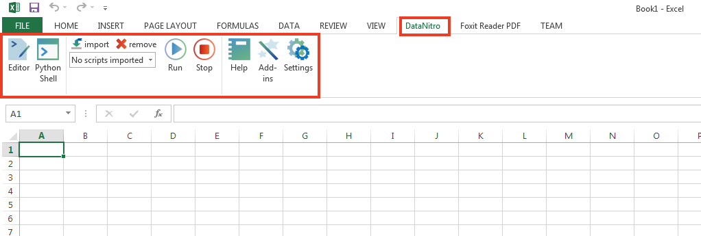
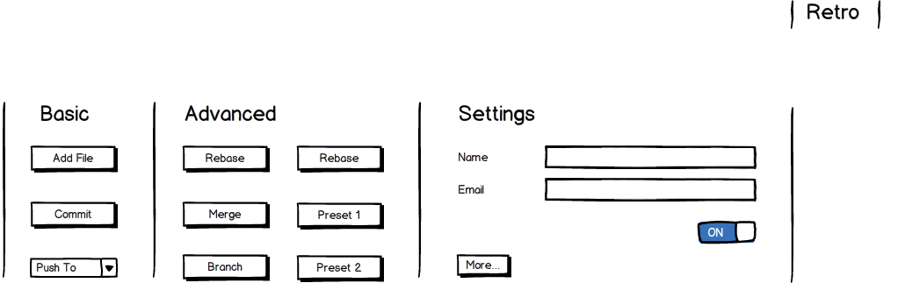

# Card 1

### What it is?

Basic UI of Retro in MS Office

### Expected milestone

Create a basic UI mockup that can interact with other functions.

I want something like this: 

The Balsamiq mockup is this: 

It must work well with Windows and Mac. When clicking a button, it will invoke a placeholder function. All buttons will invoke the placeholder function as of now. Push To combobox will show Remote One and Remote Two.

The placeholder function:

```python
def card001func():
	print 1+1
```