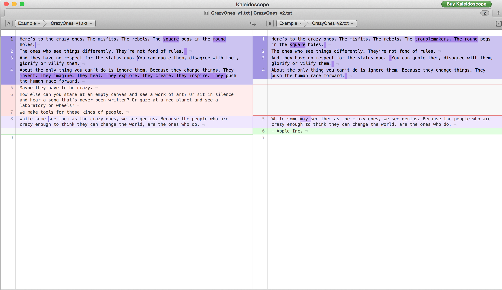
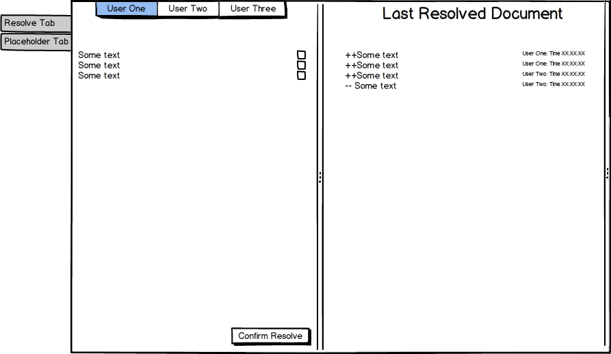

# Card 6

### What it is?

Merge/conflict resolve UI

### Expected milestone

The UI should be displayed when a function is being invoked i.e.

```python
def showMergeToolWindow():
	# code to invoke the window.
```

Create a basic UI mockup that can interact with other functions.

The inspiration is Kaleidoscope app:  although this screenshot does not show the left tabs and the source of merging documents i.e. User One, User Two, User Three.

The Balsamiq mockup is this:  

