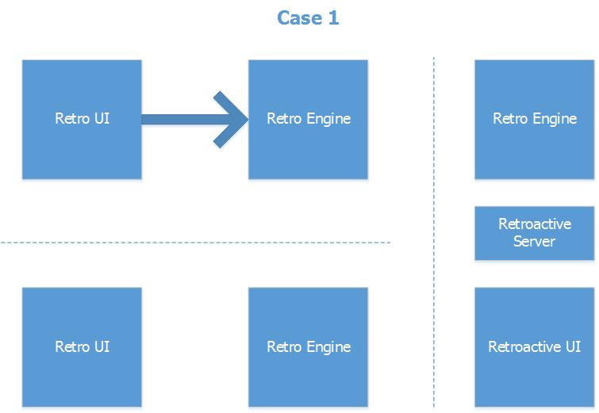
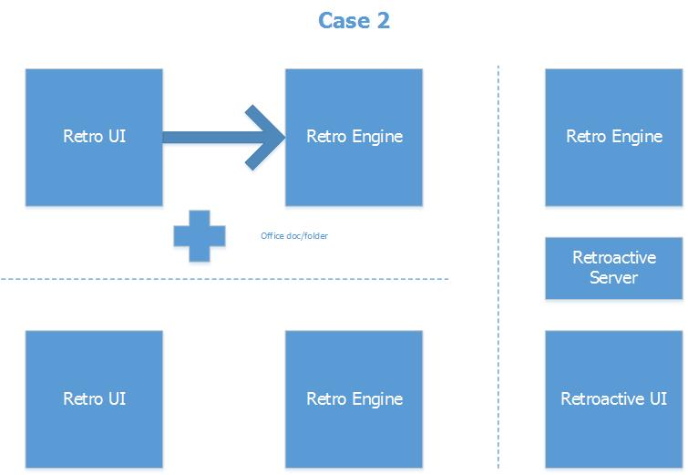
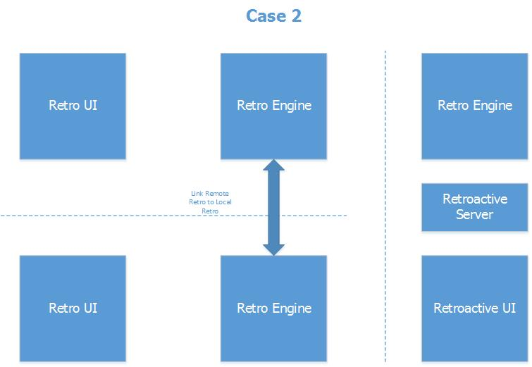
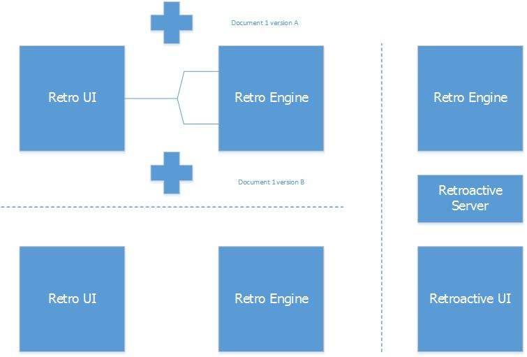
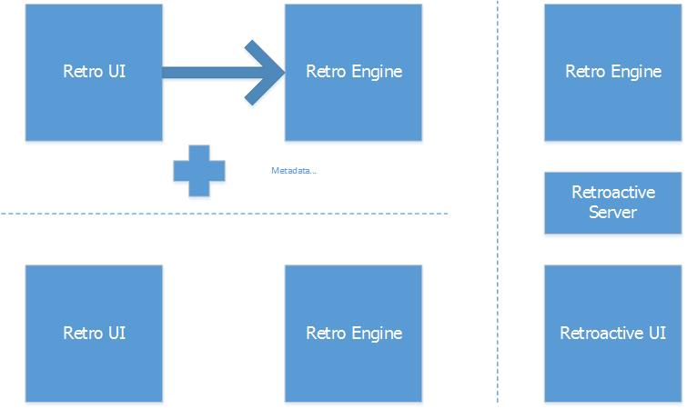
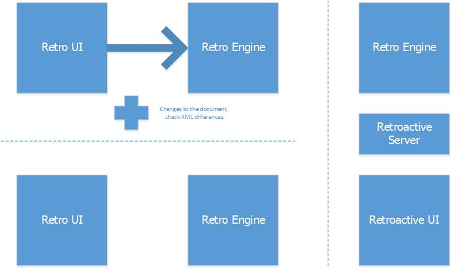
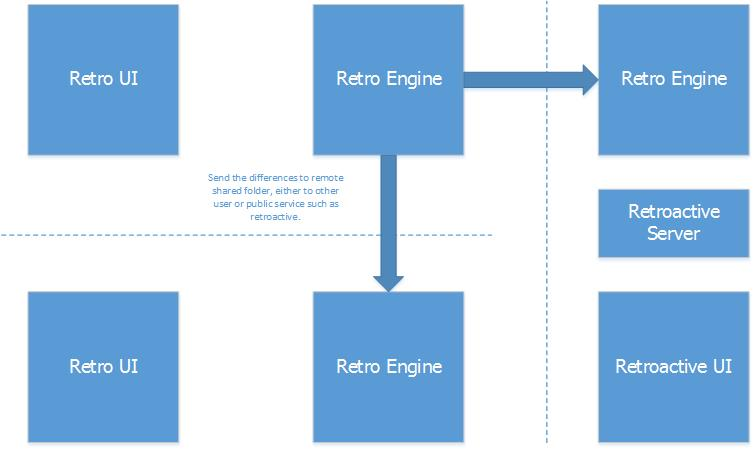
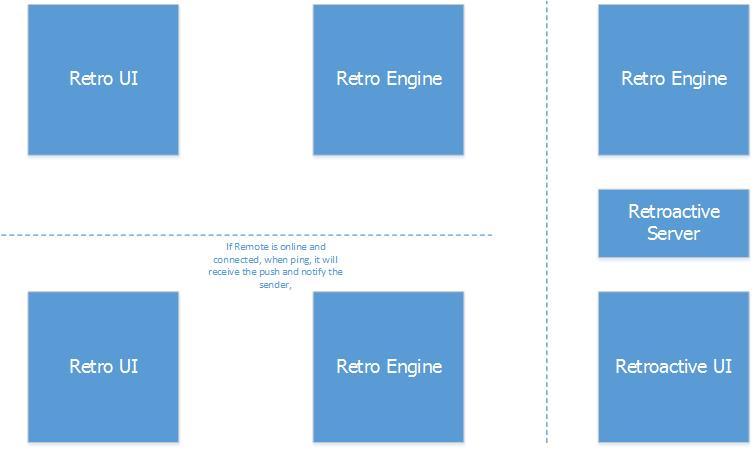

# Retro: Technical Specification
Written by __Philip Heines__ on November 11, 2014

## Goal

To allow Git-like functionalities to MS Word, Excel, Powerpoint users.

## System Architecture

It will run on Windows and Mac. Built entirely on Python. Differentials of XML(.docx,.pptx,.xlsx are based on) will be checked and saved by a __Retro Engine__. 

We want to attack this office file format from XML point of view.

## Control Flow

For git users, it follows git workflow. Nevertheless, this is for MS Office. 

What a user can do:

1. User creates a _shared folder_ that is tracked by _Retro Engine_. 
2. User adds file(s) to the _shared folder_. 
3. User adds/edits remote(s) _shared folder_.  
4. User adds/edits branch(es). Branches allow multiple workflows and different version of document to be tracked together.  
5. User adds/edits tag(s).  
6. User commits file(s) by saving the document using native MS save function.  
7. User pushes the _shared folder_ to remote(s). Optional for user: push tag and branch.  
8. Remote Retro receives the _shared folder_.  
9. User clones the _shared folder_ from remote(s).  
10. User pulls the _shared folder_ from remote(s).  
11. User merges the differences of the documents in the _shared folder_.  
12. User resolves the conflicts of the documents, if any, in the _shared folder_.  

## Background Tasks

- Installed on MS Office:

1. Keep track of changes/saves that are made by user when editing
2. Push the changes/addition/deletion to the remote(s).
3. When online, can receive a push from other users

- Instalalled on remote:

1. Receive push from users.

## Interface To Other Systems

There will be two interfaces, one is with MS Office and the other would Retro installed on remote(s).

1. Deal with MS Office
2. Deal with Flask/Django for web UI of the remote.

## Non-Functional Requirements

1. None
